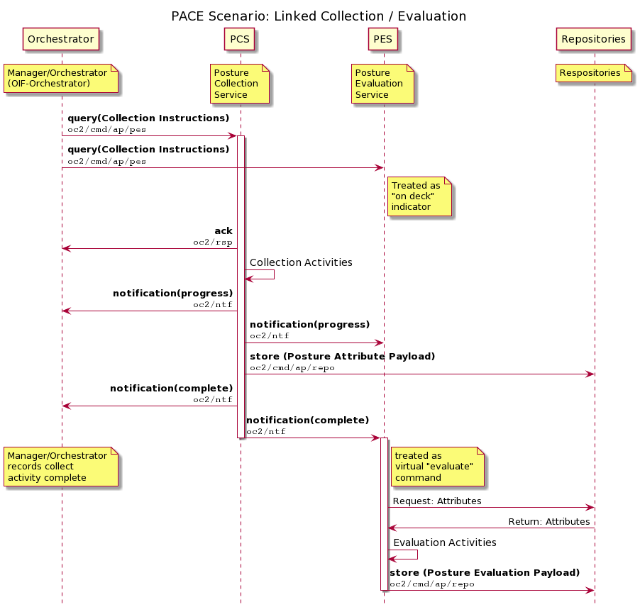

# Linked *Ad Hoc* Collection & Evaluation Concept
This paper describes a notional use case where an _ad hoc_
collection is invoked and the status messages signaling its
completion trigger a corresponding _ad hoc_ evaluation of the
newly collected data. This approach includes use of the currently
undefined OpenC2 `notification` message type. The PACE project
provides excellent use cases for substantiating the need for this
message type.

The essential notion for this concept is that the Posture
Evaluation Service (PES) monitors the command channel for the
Posture Collection Service (PCS). Detection of collection
instructions sent to the PCS puts the PES "on deck" to perform a
corresponding evalution, and detection of a completion notice
acts as a virtual command to start the evaluation.

## Publish/Subscribe Topics

This example employs the following pub/sub topics (the naming
used here is notional and based on the in-development *OpenC2
MQTT Transfer Specification*):

* `oc2/cmd/ap/pcs` -- command channel for the PCS
  * published to by the Manager / Orchestrator
  * monitored by the PCS for tasking
  * monitored by the PES for situational awareness
* `oc2/rsp` -- response topic for OpenC2 commands
  * monitored by the Manager/Orchestrator
  * published to by any element sending an OpenC2 response
* `oc2/ntf` -- notification topic for asynchronous notification messages
  * monitored by the Manager/Orchestrator, PCS, PES, potentially other elements
  * published to by any element with status information to share

## Scenario

1. The Manager/Orchestrator determines an _ad hoc_ posture
   attribute collection is needed. It publishes collection
   instructions in the form of an OpenC2 `query` action to
   `oc2/cmd/ap/pcs`, with arguments specifying what is to be
   collected.
2. The PCS detects the `query` action, publishes an OpenC2
   response message to `oc2/rsp` acknowledging the command, and
   being the attribute collection process. The PCS may publish
   process indicator messages to the `oc2/ntf` channel as
   collection proceeds.
3. The PES detects the `query` action on `oc2/cmd/ap/pcs` and
   recognizes that an _ad hoc_ collection has started. The PES
   begins monitoring `oc2/ntf` for status messages related to the
   collection, using the OpenC2 `command_id` value to correlate
   notifications to the original command.
1. When the PCS has completed the collection of the requested
   attributes, the results are persisted to the Posture Attribute
   Repository (mechanism TBD; illustrated in the sequence diagram as an OpenC2 `store` action).
1. When the attributes have been stored in the Posture Attribute
   Repository, the PCS will publish a final notification message to `oc2/ntf` indicating completion.
1.  The Manager/Ochestator detects the final notification message and records that the _ad hoc_ posture attribute collection activity has concluded.
2.  The PES detects the final notification message and treats it as a "virtual command", performs a posture evaluation against the newly-collected attributes, and persists the results to an Evaluation Results Repository.

The scenario is illustrated in the sequence diagram below:




PlantUML source for sequence diagram
```
@startuml
' PlantUML source to generate sequence diagram:
' *************************
' PACE Scenario: Linked Collection / Evaluation
' *************************
' Use with PlantUML.com's online server
' http://www.plantuml.com/plantuml/uml/SyfFKj2rKt3CoKnELR1Io4ZDoSa70000
' Paste this code in and use submit button to 
' regenerate the diagram
'
' Select PNG by diagram to get clean image file to download / embed 
'
' PlantUML help for sequence diagram formatting is at 
' https://plantuml.com/sequence-diagram


Title PACE Scenario: Linked Collection / Evaluation
hide footbox
skinparam sequenceMessageAlign direction
participant Orchestrator as O
participant PCS as C
participant PES as E
participant Repositories as R

' Use leading "/" to align tops of notes
note over O: Manager/Orchestrator\n(OIF-Orchestrator) 
/ note over C: Posture\nCollection\nService
/ note over E: Posture\nEvaluation\nService
/ note over R: Respositories
O -> C : **query(Collection Instructions)**\n""oc2/cmd/ap/pes""
Activate C
O -> E : **query(Collection Instructions)**\n""oc2/cmd/ap/pes""
note right of E: Treated as\n"on deck"\nindicator
C -> O : **ack**\n""oc2/rsp""
C -> C : <size:14>Collection Activities</size>
C -> O : **notification(progress)**\n""oc2/ntf""
C -> E : **notification(progress)**\n""oc2/ntf""
C -> R : **store (Posture Attribute Payload)**\n""oc2/cmd/ap/repo""
C -> O : **notification(complete)**\n""oc2/ntf""
C -> E : **notification(complete)**\n""oc2/ntf""
note over O: Manager/Orchestrator\nrecords collect\nactivity complete
/ note right of E: treated as\nvirtual "evaluate"\ncommand
deactivate C

activate E
E -> R: Request: Attributes
R -> E: Return: Attributes
E -> E: <size:14>Evaluation Activities</size>
E -> R : **store (Posture Evaluation Payload)**\n""oc2/cmd/ap/repo""
deactivate E
@enduml
```


