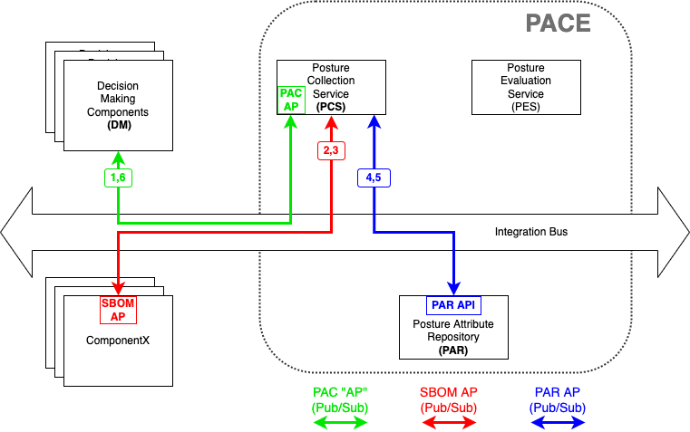
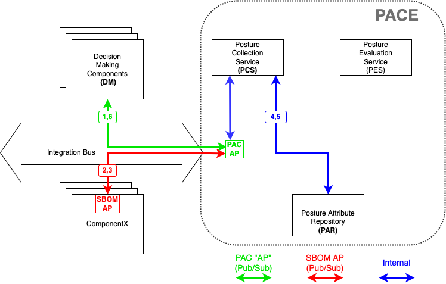

# Collect SBOM from device

This is a PCS use case where a decision-maker (outside PACE)
requests PACE (the PCS component of PACE is particular)
to obtain an SBOM by going to the device.

The command sequencing can be seen in either of the following
figures depending on whether it is the component or monolithic
PACE.

Note that to the outside world, the two PACE systems behave the same
with the same interfaces.
The difference is the internal interfaces are public standard
interfaces in one case, and internal proprietary interfaces
in the other.

The first case also allows for interworking between different implementations
of PCS/PAR.
E.g. where vendor1 provided the PCS and an open source project
was used for the PAR.

