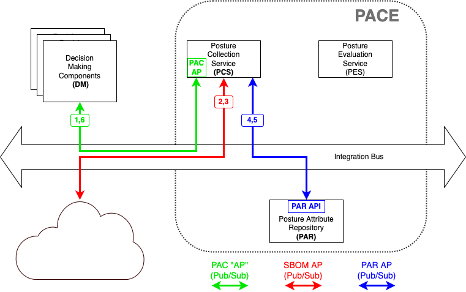

# Collect SBOM from URL

This is a PCS use case where decision-maker (outside PACE)
requests PACE (the PCS component of PACE is particular)
to obtain an SBOM by going to a particular URL.

The command sequencing can be seen in either of the following
figures depending on whether the internet is accessed
over the integration bus or directly.

