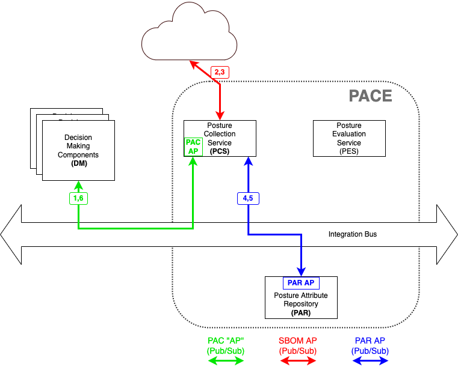

# Collect SBOM from URL

This is a PCS use case where decision-maker (outside PACE)
requests PACE (the PCS component of PACE is particular)
to obtain an SBOM by going to a particular URL.
How the decision-maker obtained the URL is immaterial
to this use case. It may have been from vendor documentation
or it may have been from MUD (add reference) or ...

The PCS interface to the internet is outside the scope
of PACE as how the system does it will not affect interworking.

Note the above diagram assumes the component PACE architecture.
A similar diagram could be made for the monolithic PACE architecture.
