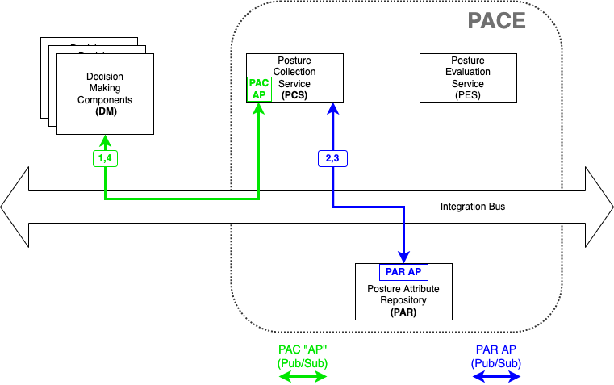

# Command containing SBOM puts SBOM in PACE

This is a PCS use case where a decision-maker (outside PACE)
gives PACE (the PAR component of PACE is particular)
an SBOM.

Note this is the same whether monolithic or component PACE architecture
since only the PAR is involved.

Note this is the same command as when a PCS puts an SBOM in the PAR -
eg step 4 in [Collect SBOM from Device](./CollectSbomFromDevice.md).
