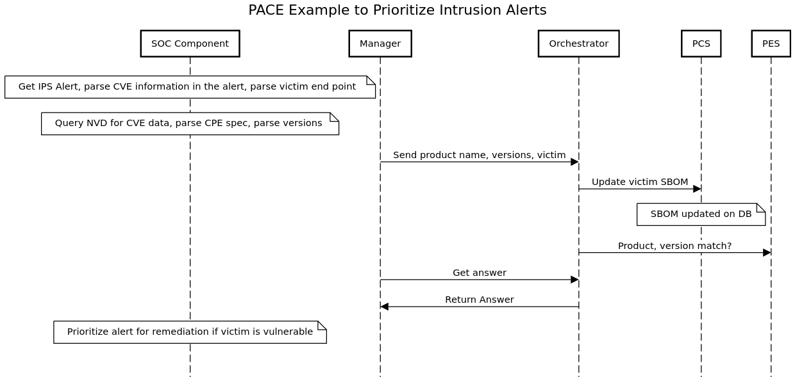

# PACE Example to Prioritize Intrusion Alerts

The use case is to help SOC admins prioritize alerts from security devices like IPS for investigation. Network devices like IPS raise many alerts purely based on the context observed in the network traffic. However the end point context may render the alert irrelevant. For example, an exploit observed by IPS in the network payload may not be relevant if the vulnerable version of the software involved is not running on the end point. The idea here is to use PCS and PES to ascertain the relevancy of alerts.

SACM architecture to enable this use case is still under development. The flow below shows a rough mapping of the flow to PCS and PES components. Next steps TBD.


### Text for Sequence Diagram
```
title PACE Example to Prioritize Intrusion Alerts


note over SOC Component: Get IPS Alert, parse CVE information in the alert, parse victim end point  
note over SOC Component: Query NVD for CVE data, parse CPE spec, parse versions
Manager->Orchestrator: Send product name, versions, victim
Orchestrator->PCS: Update victim SBOM
note over PCS: SBOM updated on DB
Orchestrator->PES: Product, version match?
Manager->Orchestrator: Get answer
Orchestrator->Manager: Return Answer
note over SOC Component: Prioritize alert for remediation if victim is vulnerable
```
