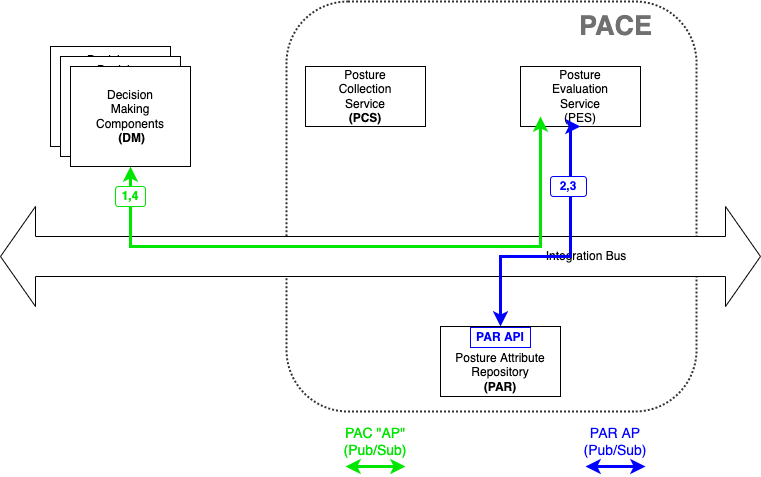
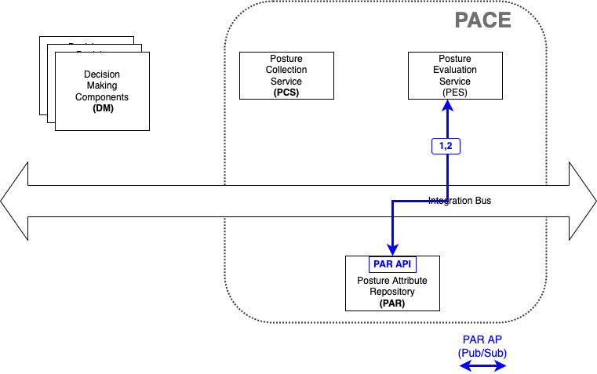

# Retrieve SBOM

Although this is a very straight forward use case -
to obtain the previously stored SBOM data -
there are many subtle variants.

## Retrieve SBOM as provided
The simplest, most obvious retrieval case
is to retrieve the SBOM in the same
format and serialization which was originally provided to PACE.
For example a CycloneDX JSON SBOM was collected
from a particular device,
and decision-maker
requests that CycloneDX JSON SBOM.

The flow may look like the following,
but note this may not be an acceptable architecture
(read further to understand the issue).

Figure 1

A similar use case is a Posture Evaluation System (PES)
requests that same CycloneDX JSON SBOM
(ie orginal format and serialization).

Figure 2

## Format/serialization Conversions
Some PACE systems will have the ability to transform
the format or the serialization of the SBOM.

Figure 3

There are 4 classes of transformations in this figure:

Figure 4

- S1 - convert between CycloneDx serializations (eg between JSON and XML)
- S2 - convert between SPDX serializations (eg between JSON and RDF)
- F1 - convert from CycloneDX to SPDX
- F2 - convert from SPDX to CycloneDX

Although the commands remain identical as in the previous diagrams,
the flow may be different.

There are potential security issues with direct access
to the PAR in the first figure above.
Thinking at the moment is to limit access to the PAR
to only the PCS and PES.
This would result in the simple case above being handled the
same way as a PES use case.

Architectural question - will this transformation be done
as part of the PAR or is it a PES function.
This text is proposing it is part of PAR function so that PAR is data only.
This means that when a transformation is required,
the flow would be:
---

Figure 5

---
## Retrieve SBOM as provided - reprise
The concept of direct access
to the PAR API
from outside the PACE system
is still open to debate.
Reasons to consider always using the architecture
in Figure 5 (even for the case of Figure 1)
If the authentication/authorization resides entirely
with the PCS or PES components,
then the simple retrieve SBOM case of Figure 1
would use the architecture of Figure 5.

## Subset of SBOM data

All of the above is for the entire SBOM.
It is a separate use case for individual fields in the SBOM
to be requested instead of the entire SBOM.
Ie request 'data from the SBOM' instead of the entire SBOM.
See NeedToFillIn.

## SBOM evaluation
It is also a separate use case to request evaluation of the data
from the SBOM.
See NeedToFillIn/
